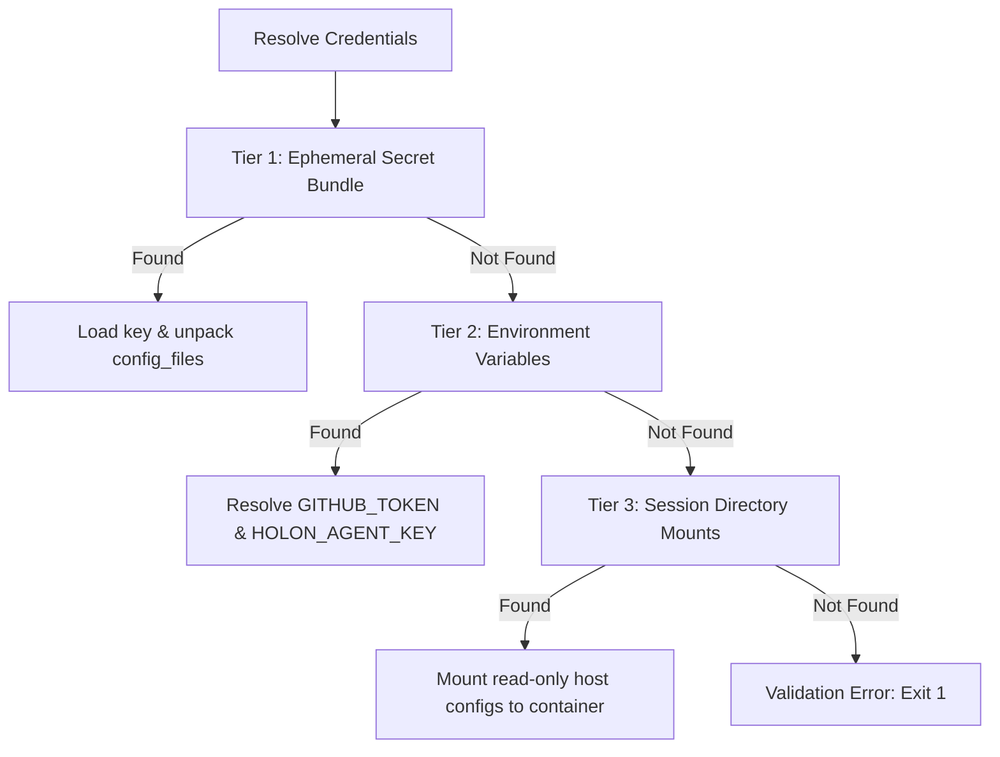

# Agent Credentials & API Key Requirements

To maintain a secure and decoupled sandbox model, the Sandbox Executor does not hardcode api keys or sensitive
configuration files. Instead, it utilizes a multi-tier fallback system to retrieve and configure credentials at runtime
before starting any AI agent.

---

## The 3-Tier Fallback Contract

Credentials resolution follows three distinct fallback tiers, which are queried in sequence:

### Tier 1: Ephemeral Secret Bundle

- **Source**: Resolved from the file path specified in `HOLON_SECRET_BUNDLE_PATH` (defaults to
  `/run/secrets/holon_auth.json`).
- **Use Case**: Typically used in automated CI/CD pipelines or orchestrated sandbox grids where credentials are
  provisioned dynamically for a single execution.
- **Handling**:
  - The executor reads and parses the JSON secret bundle.
  - If the bundle includes an `api_key` or `token`, it is written to the `HOLON_AGENT_KEY` environment variable.
  - If the bundle includes a `config_files` dictionary, its key-value pairs (relative paths to file contents) are
    unpacked into the sandbox user's home directory.

#### Path Traversal Protection

During the unpacking of configuration files from the ephemeral secret bundle, a path-traversal safeguard is strictly
enforced to prevent malicious or malformed bundles from writing files outside the sandbox user's home directory (e.g.
overwriting `/etc/shadow` or `/usr/bin/`).

- **Validation Logic**:
  1. The target path is constructed via `os.path.abspath(os.path.expanduser(rel_path))`.
  2. The sandbox home directory is retrieved via `os.path.abspath(os.path.expanduser("~"))` and appended with a
     directory separator.
  3. The target path is verified to ensure it strictly starts with the resolved home directory prefix.
  4. If the target path attempts to write outside the home directory, a `ValueError` is raised, and the execution is
     aborted.

---

### Tier 2: Environment Variables

- **Source**: Environment variables forwarded directly to the container/process.
- **Key Variables**:
  - `HOLON_AGENT_KEY`: The primary API key or bearer token used by the agent runner.
  - `HOLON_AGENT_OSS_MODE`: Set to `true` or `1` to run agents in offline or open-source modes without requiring
    external API keys.
  - `HOLON_AGENT_PROVIDER`: Specifies the target model provider (e.g., `openai`, `anthropic`, `google`).
  - `HOLON_AGENT_SETTINGS`: Custom JSON or file-path configurations passed directly to the agent.
  - `GITHUB_TOKEN` / `GH_TOKEN`: Authenticates git fetch and push operations. The `./holon` host CLI automatically
    retrieves this token using `find_github_token()`, falling back to the local `gh` CLI credentials if not set in the
    environment.

---

### Tier 3: Session Directory Mounts

- **Source**: Host credential directories mounted read-only (`:ro`) into the corresponding paths inside the container
  user's home folder (`/home/holon/`).
- **Use Case**: Enables seamless developer experience when executing containerized runs locally, reusing credentials
  stored on the host.
- **Mapping (Host -> Container)**:
  - **Antigravity**: `~/.gemini/antigravity-cli` -> `/home/holon/.gemini/antigravity-cli` & `~/.config/antigravity` ->
    `/home/holon/.config/antigravity`
  - **Claude**: `~/.config/claude` -> `/home/holon/.config/claude`
  - **Codex**: `~/.codex` -> `/home/holon/.codex`
  - **Pi**: `~/.config/pi` -> `/home/holon/.config/pi`
  - **Gemini**: `~/.config/gcloud` -> `/home/holon/.config/gcloud`

---

## Agent-Specific Requirements & Configuration Mappings

Each agent has specific command-line structures and validation routines:

### 1. `antigravity`

- **Binary**: `agy`
- **Command template**: `agy --model <model_name> --effort <HOLON_AGENT_EFFORT> -p <prompt>`
- **Effort Evaluation**: The `--effort` argument (e.g., `medium`, `high`) is resolved dynamically at runner execution
  time to support runtime environment changes.
- **Validation**: Requires `HOLON_AGENT_KEY` to be set, or an active session directory mounted to
  `/home/holon/.gemini/antigravity-cli` or `/home/holon/.config/gcloud`.

### 2. `gemini`

- **Binary**: `gemini`
- **Command template**: `gemini --model <model_name> -p <prompt>`
- **Validation**: Requires `HOLON_AGENT_KEY` to be set, or active gcloud credentials mounted to
  `/home/holon/.config/gcloud`.

### 3. `claude`

- **Binary**: `claude`
- **Command template**: `claude --model <model_name> --settings <HOLON_AGENT_SETTINGS> -p <prompt>`
- **Validation**: Requires `HOLON_AGENT_KEY` to be set, or active session configuration mounted to
  `/home/holon/.config/claude`.

### 4. `pi`

- **Binary**: `pi`
- **Command template**: `pi -p --model <model_name> --provider <HOLON_AGENT_PROVIDER> <prompt>`
- **Session directories**: `~/.pi/agent` is the agent directory for pi 0.84 and later (it holds `models.json` with the
  provider definitions); `~/.config/pi` is the legacy layout and is still mounted when present.
- **Validation**: Requires `HOLON_AGENT_KEY` to be set, active session configuration mounted to `/home/holon/.pi/agent`
  or `/home/holon/.config/pi`, or host-local model mode (see [Host-Local Model Endpoints](#host-local-model-endpoints)).

### 5. `opencode`

- **Binary**: `opencode`
- **Command template**: `opencode run --model <model_name> --agent <HOLON_AGENT_MODE> <prompt>`
- **Validation**: Requires the `HOLON_AGENT_KEY` environment variable.

### 6. `codex`

- **Binary**: `codex`
- **Command template**:
  `codex exec -m <model_name> [--oss] [--local-provider <HOLON_AGENT_LOCAL_PROVIDER>] [-c <HOLON_AGENT_CONFIG>] <prompt>`
- **Offline / Open-Source Mode**: If `HOLON_AGENT_OSS_MODE=true` is set, the `--oss` flag is appended, and API key
  validation is skipped.
- **Validation**: Requires `HOLON_AGENT_KEY` to be set, `HOLON_AGENT_OSS_MODE=true`, or an active credentials session
  directory mounted to `/home/holon/.codex`.

---

## Host-Local Model Endpoints

An inference server running on the host (vMLX, Ollama, LM Studio, vLLM, llama.cpp, SGLang) is unreachable from the
sandbox under its natural address: container loopback is the container itself, and the host's own LAN address is not
routable inside the container namespace. The only address that works is the Docker gateway, `host.docker.internal`,
which `holon` now maps with `--add-host=host.docker.internal:host-gateway` on every run so the behaviour is identical on
Docker Desktop and Linux.

Enable it explicitly:

| Variable                 | Purpose                                                                                      |
| ------------------------ | -------------------------------------------------------------------------------------------- |
| `HOLON_LOCAL_LLM=1`      | Opt in. Never inferred from the contents of a config file.                                   |
| `HOLON_LOCAL_BASE_URL`   | Endpoint used when the host has no `models.json` to copy.                                    |
| `HOLON_LOCAL_PROVIDER`   | Provider name for the generated config (falls back to `HOLON_AGENT_PROVIDER`, then `local`). |
| `HOLON_LOCAL_MODELS`     | Comma-separated model ids served by that endpoint (required with `HOLON_LOCAL_BASE_URL`).    |
| `HOLON_HOST_LOCAL_HOSTS` | Comma-separated authorities that may be rewritten (for example the host LAN IP).             |

When opted in, `holon` builds a temporary agent directory for the container:

1. The host `models.json` is read from `~/.pi/agent` (falling back to `~/.config/pi`), or synthesized from
   `HOLON_LOCAL_BASE_URL` / `HOLON_LOCAL_MODELS` when absent.
2. Every provider `baseUrl` is rewritten to the gateway **only if** its authority is loopback or explicitly declared in
   `HOLON_HOST_LOCAL_HOSTS`. All other fields are preserved.
3. The directory is mounted read-write at `/home/holon/.holon-pi-agent` and exported as `PI_CODING_AGENT_DIR`, and the
   host agent directory is deliberately **not** mounted, so cloud credentials and session history stay on the host.
4. Because the endpoint now resolves to the gateway, it is added to `NO_PROXY` when the token-reduction sidecar is
   active; local traffic is therefore never intercepted, cached, or recorded in the wire logs.
5. If local mode cannot be satisfied (no host config and no `HOLON_LOCAL_BASE_URL`/`HOLON_LOCAL_MODELS`), the run aborts
   with an actionable error instead of starting an agent that could only fail later.

> [!WARNING] **No blanket RFC1918 rewriting.** Loopback and explicitly declared authorities only. A genuinely remote
> inference box on the same LAN must keep its address; silently redirecting it onto the host machine would change which
> model produced the agent's output without any signal that it had.

Because a local endpoint needs no provider credential, `validate()` accepts local mode in place of `HOLON_AGENT_KEY` for
runners that require a key (`pi`, `claude`, `opencode`) -- the parity `codex` already had through
`HOLON_AGENT_OSS_MODE`. The opt-in alone is not sufficient: an actual endpoint (`PI_CODING_AGENT_DIR` or
`HOLON_LOCAL_BASE_URL`) must be present, so a stray flag cannot mask a missing cloud key.
